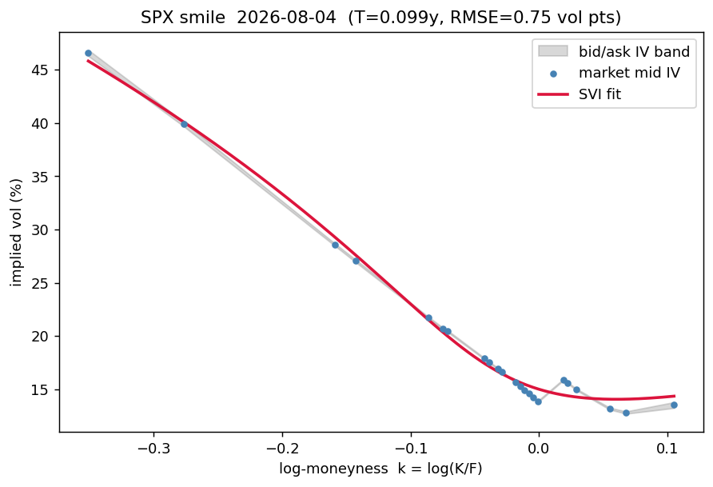
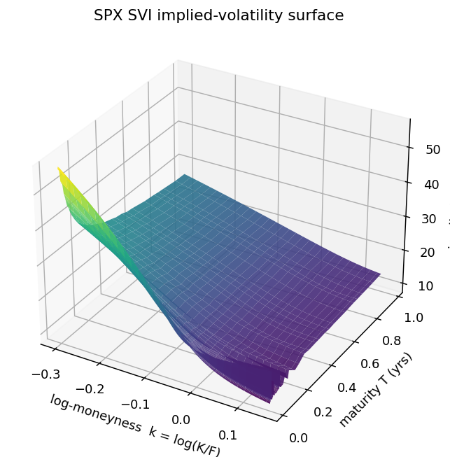
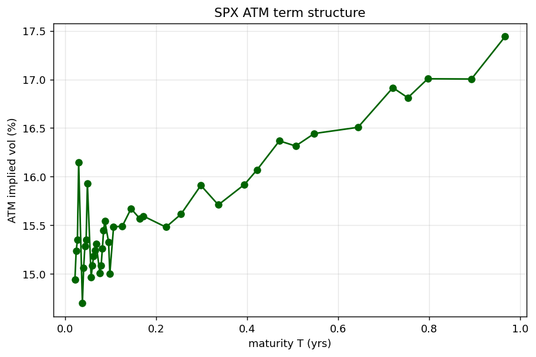
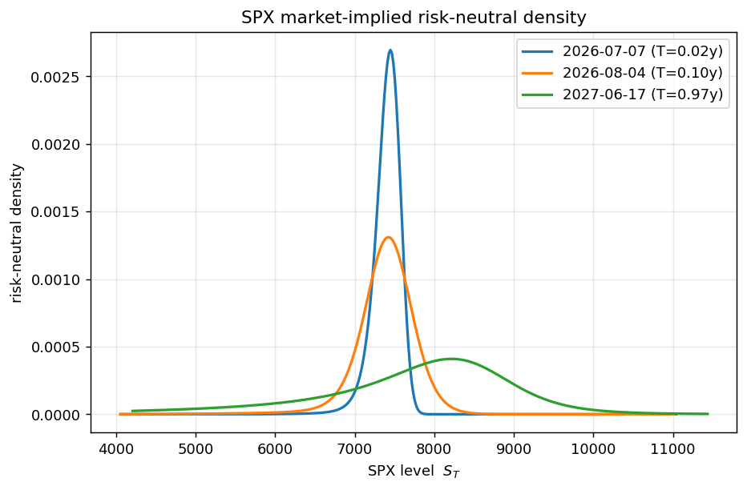

# SPX Implied Volatility Surface Calibration

Build an **arbitrage-free implied volatility surface from real SPX options data**, end to end.

The point of the project is not "plot a surface." It is the chain of decisions that turn a
dirty option chain into a usable, no-arbitrage surface: choosing an underlying where the
pricing model is actually valid, letting the market set the forward, inverting only the
informative quotes, checking the result against static-arbitrage constraints, and fitting
an industry-standard parametrization that is arbitrage-free *by construction*.

## Pipeline

```
Raw chain  ──▶ filter (positive/uncrossed quotes, spread cap, moneyness window)
           ──▶ mid-price
           ──▶ extract forward F(T) & discount from put-call parity (per expiry)
           ──▶ log-moneyness k = log(K/F)
           ──▶ invert Black–Scholes for implied vol on the OTM leg (Brent / bisection)
           ──▶ no-arbitrage checks (calendar + butterfly)
           ──▶ SVI fit per expiry slice (butterfly-free, certified via Gatheral's g(k))
           ──▶ 3D surface, smiles w/ bid-ask bands, ATM term structure
           ──▶ risk-neutral density (Breeden–Litzenberger)
```

## Assumptions & modeling choices

Each choice below is deliberate; the *why* is what a practitioner cares about.

- **Underlying: SPX index options.** SPX options are **European and cash-settled**, so
  Black–Scholes/Black-76 is the correct pricer. American equity/ETF options (SPY, AAPL)
  carry an early-exercise premium that contaminates BS-inverted vols, especially for ITM
  puts. Using SPX removes that error source entirely rather than approximating it away.

- **Forward from put-call parity, not `F = S·e^{rT}`.** For each expiry we regress
  `C − P` on strike `K`: the slope is `−e^{−rT}` (the discount factor) and the intercept
  is `e^{−rT}·F`. This lets the *market* set the forward, implicitly capturing dividends
  and carry, instead of hard-coding a rate and dividend yield. The forward — not spot — is
  the correct anchor for the smile (`k = log(K/F)`).

- **Invert the OTM leg only.** At each strike we keep the out-of-the-money option (calls
  for `k>0`, puts for `k<0`). OTM options carry the volatility information (high vega, no
  intrinsic value); ITM options are dominated by intrinsic value and yield noisy,
  unreliable inverted vols. Strikes whose OTM leg is illiquid are dropped, not back-filled
  with the ITM leg.

- **Liquidity via quotes, not open interest (data-source specific).** yfinance reports
  `openInterest = 0` for nearly all `^SPX` options, so an OI filter would discard ~99% of
  strikes. The effective liquidity gate here is **positive bid + a relative-spread cap**.
  The OI threshold remains configurable for a source with reliable OI.

- **SVI parametrization (Gatheral).** Total variance is modelled per slice as
  `w(k) = a + b[ρ(k−m) + √((k−m)² + σ²)]`. Five parameters with clear meaning
  (`a` level, `b` wing slope, `ρ` skew, `m` shift, `σ` ATM curvature), it is the industry
  standard, and butterfly-freeness can be **certified analytically** via Gatheral's
  `g(k) ≥ 0`. A raw spline would fit points but guarantee nothing about arbitrage.

- **Risk-neutral density in closed form.** Breeden–Litzenberger says the RND is the
  (discounted) second derivative of the call price in strike. Taking that derivative on
  raw quotes is hopelessly noisy; instead we use the closed-form density implied by the
  fitted SVI slice — which shares the same `g(k)` as the butterfly check, so an
  arbitrage-free slice automatically yields a non-negative density that integrates to one.

## Results

```
===== SPX volatility-surface diagnostics =====
as-of 2026-06-29   spot 7354.02
raw quotes ............... 19901
after cleaning ........... 13363
OTM points with IV ....... 7920  across 41 expiries
raw butterfly violations . 2615 (33.0% of points)
raw calendar violations .. 163
SVI slices fit ........... 41  (all butterfly-free: True)
median fit RMSE .......... 0.52 vol points
```

**Reading the result:** the raw inverted grid is *not* arbitrage-free — about a third of
its points violate butterfly convexity (a negative implied density), plus 163 calendar
crossings. The SVI fit removes all of them — **41/41 slices certified butterfly-free** —
while staying within ~**0.5 vol points** of the market mids (well inside typical bid-ask IV
widths). That gap between the raw grid and the fitted surface is the whole value of the
exercise: a smooth, tradeable, no-arbitrage surface out of noisy quotes.

### Per-expiry smile — fit vs market



Market mid IVs (dots) sit inside their bid/ask IV band (grey); the SVI curve (red) threads
through them at sub-vol-point error. The shape is a **downward skew** — steep on the
downside (OTM puts), flattening and turning up slightly on the call side. This is the single
most important sanity check: the parametric fit reproduces the data without leaving the
tradeable band.

### 3D volatility surface



Implied vol over `(log-moneyness, maturity)`. Two structural features are visible at once:
the **downside skew** (vol rising toward negative `k`) and how that skew is **steepest at
the short end and flattens with maturity** — the characteristic "skew decay" of index
options.

### ATM term structure



ATM (`k=0`) implied vol versus maturity. It is **upward-sloping** here (~15% front, ~17%
near 1Y) — the typical calm-regime shape, where near-term vol is cheap relative to longer
horizons. An inverted (downward) term structure would instead signal near-term stress.

### Risk-neutral density



The market-implied distribution of `S_T` for near, mid, and far expiries (Breeden–
Litzenberger, closed-form from each SVI slice). Near-dated densities are **tightly peaked**
around the forward; the 1Y density is **broad, shifted right** (drift) with a pronounced
**fat left tail** — the market-implied probability of a large SPX drawdown. This is the
economic payoff of the whole pipeline: a distribution, not just a vol number.

## Observations

- **The forward curve is in contango (F > spot).** Spot 7354 → forward 7399 at 1 week,
  7665 at ~1 year, implying a net carry `r − q ≈ 4.3%/yr`. With the risk-free rate above
  the SPX dividend yield, the forward sits above spot — exactly what put-call parity should
  recover, and a sanity check that the parity regression is working.

- **The smile is a downward skew, not a symmetric smile.** Implied vol rises sharply for
  low strikes (OTM puts) and is lowest near/above the money. This is the equity-index
  signature: demand for crash protection bids up downside puts, so the left wing is rich —
  the market prices a negatively-skewed return distribution.

- **The ATM term structure is upward-sloping** (≈15% at the front to ≈17% near 1Y).
  Short-dated vol is low and long-dated vol is higher — the typical calm-regime shape
  (an inverted/downward term structure usually signals near-term stress).

- **SVI `ρ` is strongly negative and steepest at the short end** (median ρ ≈ −1.0 for
  weeklies, ≈ −0.58 past 6 months). Short-dated skew is extreme — the parameter pins to its
  bound — and flattens with maturity, the well-documented "skew decay" of index options.
  The wing-slope `b` rises with maturity (≈0.03 → 0.09), i.e. total-variance wings widen
  with horizon.

- **The risk-neutral density evolves the way theory predicts.** Near-dated densities are
  tightly peaked around the forward; longer-dated densities are broad, shifted right (drift)
  and carry a **fat left tail** — the market-implied probability of a large SPX drop. This
  is the economic payoff of the surface: a distribution, not just a vol number.

> These are point-in-time observations from a single delayed snapshot; magnitudes move with
> the market. The *directions* (contango forward, negative skew, skew decay, left-tailed
> density) are structural and robust.

## Setup

The system Python here is 3.8 (EOL); **Python 3.11+ is recommended**. Dependency bounds are
kept 3.8-compatible so it still runs on the system interpreter (if `python3-venv` is
unavailable, `virtualenv .venv` works too).

```bash
python3 -m venv .venv && source .venv/bin/activate
pip install -e ".[dev]"
```

## Run

```bash
python -m volsurface.pipeline                 # fetch a fresh ^SPX snapshot, build everything
python -m volsurface.pipeline --use-cached    # reuse the latest saved snapshot
ruff check . && pytest                         # lint + tests (synthetic fixtures, no network)
```

Outputs: raw snapshot → `data/raw/`, fitted SVI params + diagnostics JSON →
`data/processed/`, figures → `outputs/`. A stage-by-stage walkthrough lives in
`notebooks/01_walkthrough.ipynb`.

## Reference

Gatheral & Jacquier, *Arbitrage-free SVI volatility surfaces*, Quantitative Finance (2014).
